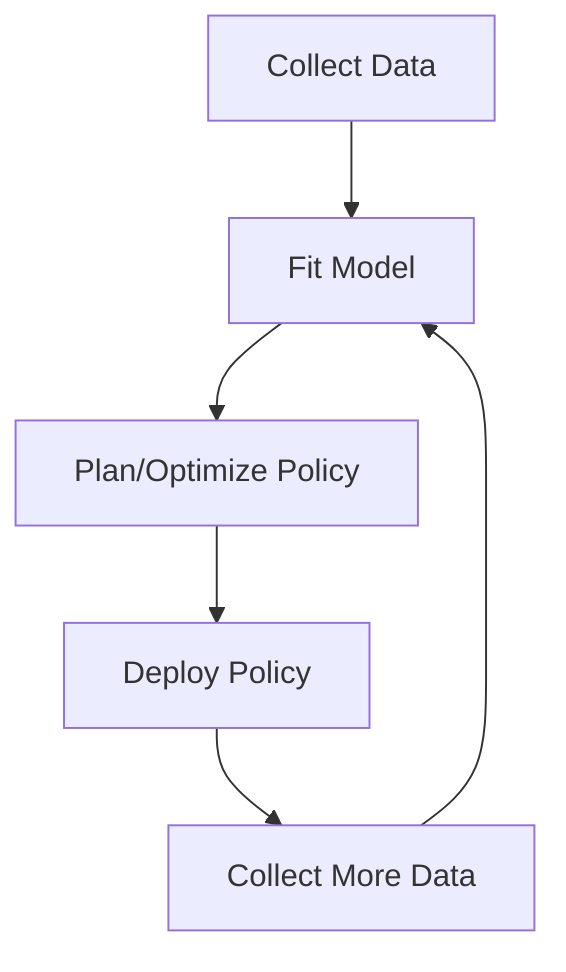
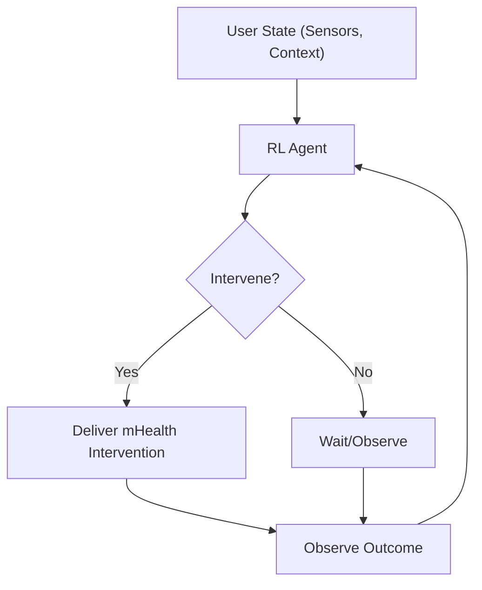

# Module 6: Advanced RL Techniques & Agent Architecture - Study Notes

## Overview
Tổng hợp về function approximation với neural networks, applications thực tế của RL, và các design choices trong agent architecture.

---

## 1. Non-Linear Approximation with Neural Networks

### Concept
Neural networks là powerful non-linear function approximators được sử dụng trong RL để estimate value functions hoặc policies, đặc biệt trong environments với large hoặc continuous state spaces.

### Key Characteristics
- **Non-linear capability**: Capture complex relationships giữa states, actions, và values
- **Generalization**: Khả năng generalize across similar states và actions
- **Scalability**: Handle large state spaces hiệu quả
- **Flexibility**: Có thể approximate cả $v(s)$ và $q(s,a)$

### Training Process
- **Gradient descent và backpropagation** cho training
- **TD error** serves as loss signal
- **Experience replay** và **target networks** để stabilize learning

### TD Error Loss for Q-learning with Neural Networks
$$\text{Loss} = \left(R_{t+1} + \gamma \max_{a'} Q(s_{t+1}, a'; w^{-}) - Q(s_t, a_t; w)\right)^2$$

Trong đó:
- $w$: neural network weights
- $w^{-}$: target network weights

### Challenges
- **Stability issues**: Non-linear approximation có thể cause instability
- **Convergence problems**: Không guarantee convergence như tabular methods
- **Overfitting**: Neural networks có thể overfit với limited data

---

## 2. System Identification and Optimal Control

### System Identification
Process của building model của system từ data, key step trong model-based RL và optimal control.

### Key Components
- **Data collection**: Collect data từ environment
- **Model fitting**: Fit model để predict future states/rewards
- **Model validation**: Ensure model accuracy cho planning
- **Iterative improvement**: Alternate between data collection và model updating

### Model-Based RL Process Flow

### Optimal Control
- **Leverage learned model** để compute control strategies
- **Optimize performance criterion** based on model predictions
- **Agnostic system identification**: Provide strong guarantees even khi true system không trong assumed model class

---

## 3. RL in Mobile Health (mHealth)

### Application Overview
RL được sử dụng trong mobile health để personalize interventions và support healthy behaviors thông qua mobile devices và wearables.

### Key Features
- **Continuous data streams**: Mobile devices provide real-time user data
- **Personalized interventions**: Deliver timely, personalized support
- **Dynamic environment**: User context (location, mood, activity) changes frequently
- **Long-term optimization**: Focus on long-term health outcomes

### Average Reward Objective for mHealth
$$\bar{r}_{\pi} = \lim_{T \to \infty} \frac{1}{T} \mathbb{E}_{\pi} \left[ \sum_{t=1}^T R_t \right]$$

### mHealth RL Process

### Research Methods
- **Micro-randomized trials (MRTs)**: Collect data cho offline RL analysis
- **Online adaptation**: Real-time learning và personalization
- **Continual improvement**: Adapt decision rules as more data collected

### Challenges
- **High noise** trong reward signals
- **Small sample sizes**
- **Minimally intrusive** interventions required
- **Privacy concerns** với personal health data

---

## 4. Agent Architecture Design Choices

### 1. State Representation
- **Raw vs Processed Inputs**
  - Raw: Direct sensory data (pixels, sensor readings)
  - Processed: Higher-level features, engineered representations
- **Feature Engineering**
  - Small problems: Hand-crafted features, state aggregation
  - Complex environments: Automated feature extraction (neural networks)
- **Dimensionality**: Affects state space size và tractability

### 2. Action Representation
- **Discrete vs Continuous Actions**
  - Discrete: Finite set (up, down, left, right)
  - Continuous: Range of values (steering angles, forces)
- **Action Encoding**
  - One-hot encoding cho discrete actions
  - Parameterized representation cho continuous actions

### 3. Policy Representation
- **Tabular Policies**: Small, discrete state/action spaces
- **Parameterized Policies**: Linear function approximation hoặc neural networks
- **Stochastic vs Deterministic**
  - Stochastic: Output probabilities
  - Deterministic: Fixed actions

### 4. Value Function Representation
- **Tabular Value Functions**: Store value cho mỗi state hoặc state-action pair
- **Function Approximation**
  - Linear methods: Tile coding
  - Non-linear methods: Deep neural networks

### 5. Learning Algorithm Categories
- **Value-Based**: Learn value functions, derive policies (Q-learning, SARSA)
- **Policy-Based**: Learn policy directly (Policy Gradient, REINFORCE)
- **Actor-Critic**: Combine both approaches

### 6. Exploration Strategies
- **Epsilon-Greedy**: Random exploration với small probability
- **Softmax/Entropy-Based**: Exploration based on uncertainty
- **Optimistic Initialization**: Start với optimistic value estimates

### 7. Update Mechanisms
- **Online vs Batch**
  - Online: Update after every step
  - Batch: Update after collecting batch of experiences
- **Synchronous vs Asynchronous**
  - Synchronous: Lockstep với environment
  - Asynchronous: Parallel updates

### 8. Memory and Experience Management
- **Experience Replay**: Store và sample past experiences
- **Eligibility Traces**: Assign credit to recently visited states/actions
- **Buffer management**: Efficient storage và retrieval

### 9. Modular Design Principles
- **Separation of Concerns**: Independent components (policy, value, exploration, memory)
- **Scalability**: Easy scaling to larger problems
- **Flexibility**: Components có thể swapped/modified independently

---

## Architecture Design Framework

### Design Decision Table
| Component | Options | Considerations |
|-----------|---------|----------------|
| State Rep | Raw, Processed, Engineered | Complexity, interpretability |
| Action Rep | Discrete, Continuous | Environment constraints |
| Policy Rep | Tabular, Linear, Non-linear | State space size |
| Value Rep | Tabular, Function approx | Generalization needs |
| Learning | Value-based, Policy-based, AC | Problem characteristics |
| Exploration | ε-greedy, Softmax, Optimistic | Exploration-exploitation balance |
| Updates | Online, Batch, Sync, Async | Computational constraints |
| Memory | Replay, Traces, Buffers | Data efficiency |

---

## Key Takeaways

1. **Neural networks** enable RL trong complex environments nhưng introduce stability challenges
2. **System identification** crucial cho model-based approaches
3. **mHealth applications** demonstrate RL's potential trong real-world personalization
4. **Agent architecture** requires careful consideration của multiple design choices
5. **Modular design** preferred cho experimentation và deployment
6. **Each design decision** impacts learning efficiency, scalability, và generalization ability
7. **Trade-offs** exist giữa complexity, performance, và interpretability

---
